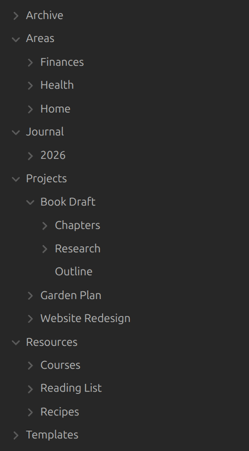
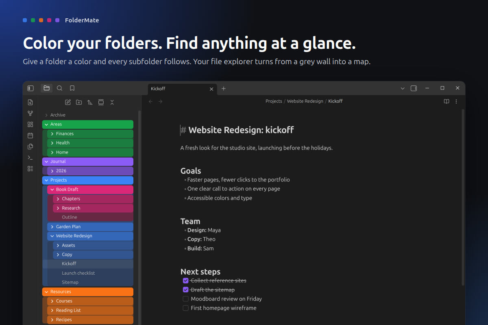
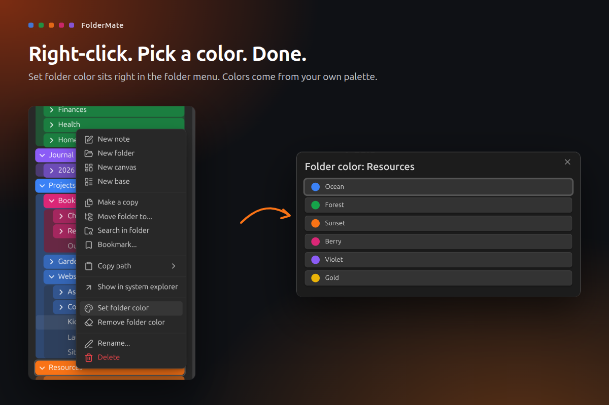
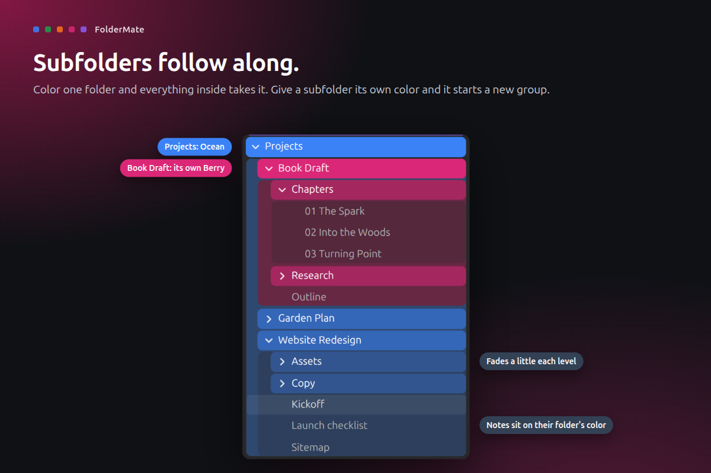
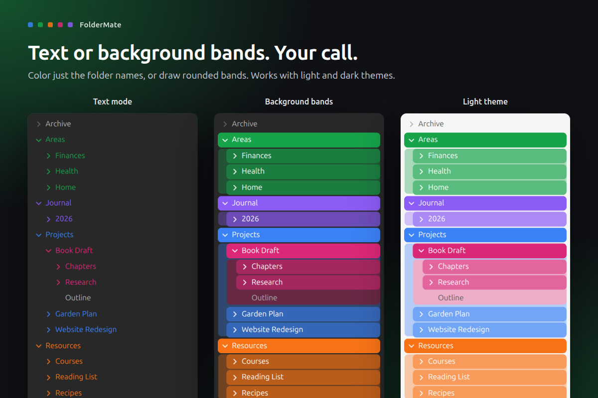
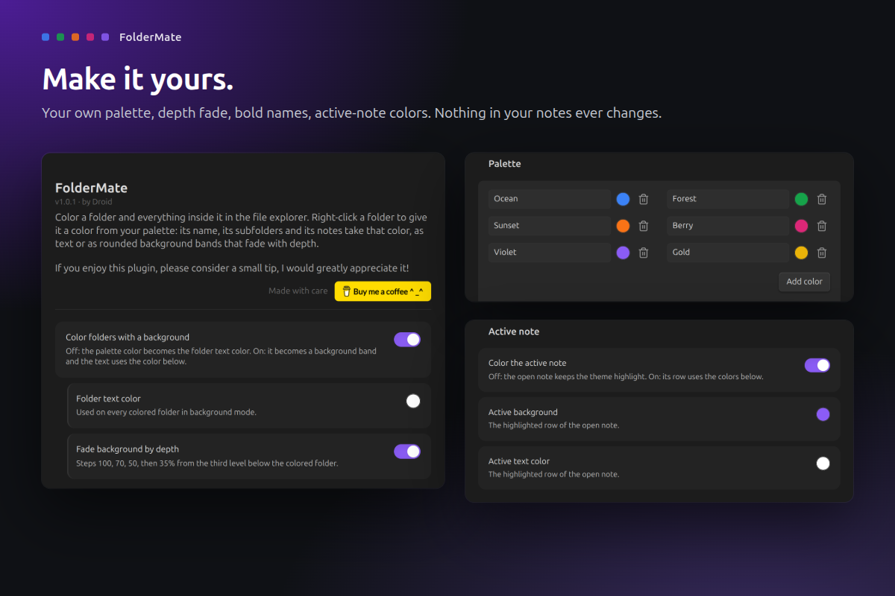

# FolderMate

**Color your folders. Find anything at a glance.**

A big vault turns the file explorer into a wall of identical grey rows. FolderMate lets you give a folder a color, and every subfolder and note inside it follows along. Right-click, pick a color, done.

## What it does

- **Right-click to color.** *Set folder color* sits in the folder menu. Pick from your own palette.
- **Subfolders follow along.** Everything inside a colored folder takes its color. Give a subfolder its own color and it starts a new group.
- **Two looks.** Color just the folder names (text mode), or draw rounded background bands that fade a little with each level.
- **Notes sit on their folder's color.** An optional soft block behind a folder's contents shows what belongs where.
- **Make it yours.** Your own palette, depth fade, bold folder names, indent lines, file name color and active-note colors.
- **Works with light and dark themes.**

## How to use

1. Install FolderMate from **Settings > Community plugins** and enable it.
2. Right-click any folder in the file explorer and choose **Set folder color**.
3. To switch looks or edit the palette, open **Settings > FolderMate**.
4. To take a color off, right-click the folder and choose **Remove folder color**.

If you use another plugin that colors the file explorer, turn it off. Both would style the same rows.

## Privacy and safety

- **Your notes never change.** Colors live in the plugin's own `data.json`. Rename or move a folder and its color goes with it.
- **No network, no telemetry.** It also has no runtime dependencies.
- **Folder paths only.** It reads folder paths and never opens a note's contents.
- **Checked colors.** A color must be a valid `#RRGGBB` value before it reaches the page.
- **Desktop only.**

## Support

If FolderMate makes your vault a little nicer, you can [buy me a coffee](https://buymeacoffee.com/droidstreamer). Thank you!

## Develop

`npm ci`, `npm test`, `npm run lint`, `npm run build` (installs into `../test-vault`), `npm run obsidian:check` (live checks in a real Obsidian), `npm run showcase` (store screenshots), `npm run ship`.

MIT licensed. Made by Droid.
